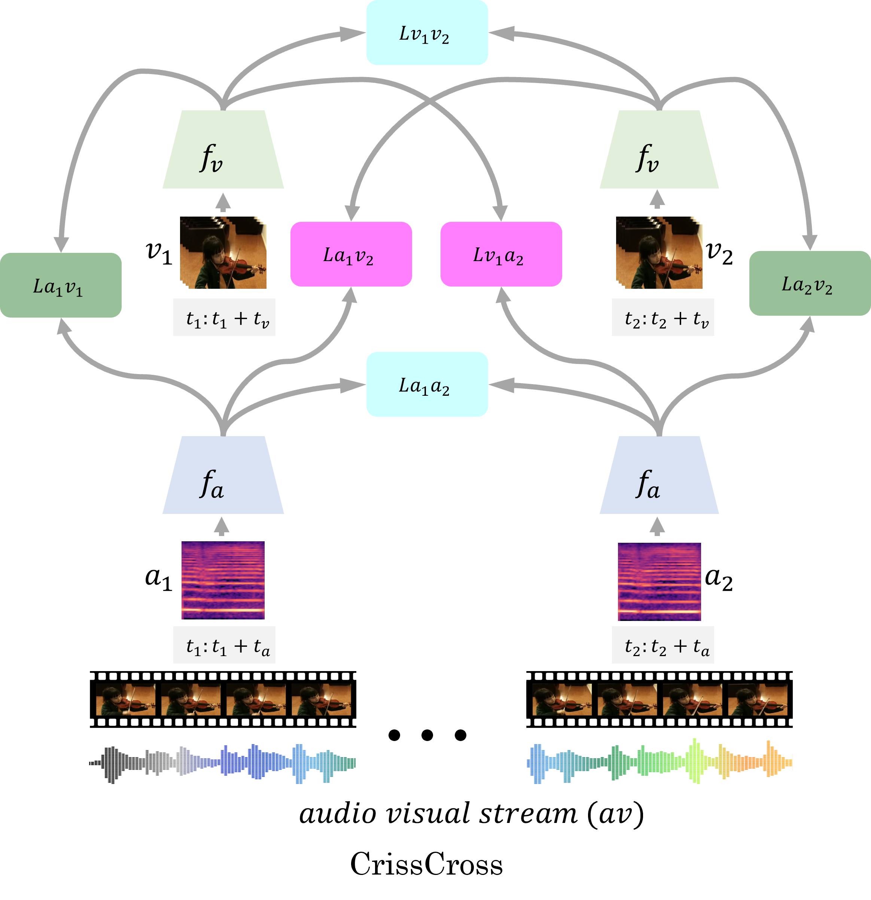

<p align="center"> 
 
</p>

<h3 align="center"> 
<a href="https://arxiv.org/pdf/">Paper</a> - <a href="https://github.com/pritamqu/crisscross">Repository</a> - <a href="https://pritamqu.github.io/crisscross/">Project Page</a> - <a href="https://www.pritamsarkar.com">My Home Page</a>
</h3>
<!-- <h1 style="text-align:center"> CrissCross Framework </h1> -->

# Self-Supervised Audio-Visual Representation Learning with Relaxed Temporal Synchronicity 
## by Pritam Sarkar and Ali Etemad

<!-- ## by [Pritam Sarkar](https://www.pritamsarkar.com) and [Ali Etemad](https://www.alietemad.com) -->

<!-- #### [Paper](https://arxiv.org/pdf/) - [Repository](https://github.com/pritamqu/crisscross) - [Project Page](https://pritamqu.github.io/crisscross/) - [My Home Page](https://www.pritamsarkar.com) -->

### Items available
- [x] Paper
- [ ] Model weights
- [ ] Evaluation codes
- [ ] Training codes

### Result
| Dataset   | Pretraining DB | Top-1 Acc. | Model | Config |
| --------  | -------------- | ---------- | ----- | -------|  
| UCF101    | Kinetics-Sound | 99.9% | [url](https://checkpoint.pth.tar) | [config](crisscross/configs/config.yaml)
| HMDB51    | Kinetics-Sound | 99.9% | [url](https://checkpoint.pth.tar) | [config](crisscross/configs/config.yaml)
| ESC50     | Kinetics-Sound | 99.9% | [url](https://checkpoint.pth.tar) | [config](crisscross/configs/config.yaml)
| UCF101    | Kinetics400 | 99.9% | [url](https://checkpoint.pth.tar) | [config](crisscross/configs/config.yaml)
| HMDB51    | Kinetics400 | 99.9% | [url](https://checkpoint.pth.tar) | [config](crisscross/configs/config.yaml)
| ESC50     | Kinetics400 | 99.9% | [url](https://checkpoint.pth.tar) | [config](crisscross/configs/config.yaml)
| UCF101    | AudioSet | 99.9% | [url](https://checkpoint.pth.tar) | [config](crisscross/configs/config.yaml)
| HMDB51    | AudioSet | 99.9% | [url](https://checkpoint.pth.tar) | [config](crisscross/configs/config.yaml)
| ESC50     | AudioSet | 99.9% | [url](https://checkpoint.pth.tar) | [config](crisscross/configs/config.yaml)


### Datasets
Please make sure, you keep the datasets in the correct directory, and also change the path in the dataloader codes. I briefly mentioned the sources of all the public datasets used in this study.
- AudioSet: I used [this](https://github.com/speedyseal/audiosetdl) repository to download AudioSet.
- Kinetics400: You can either use a crawler to download Kinetics400, or simply download from amazon aws, prepared by [CVD Foundation](https://github.com/cvdfoundation/kinetics-dataset).
- UCF101: [Website to download.](https://www.crcv.ucf.edu/data/UCF101.php)
- HMDB51: [Website to download.](https://serre-lab.clps.brown.edu/resource/hmdb-a-large-human-motion-database/)
- ESC50: You can download ESC50 from this [repository](https://github.com/karolpiczak/ESC-50).

### Self-supervised Training

### Downstream Evaluation


### Citation
Please cite our paper below when using or referring to our work.
```
@misc{sarkar2021crisscross,
      title={paper title}, 
      author={Pritam Sarkar and Ali Etemad},
      year={2020},
      eprint={2010.00104},
      archivePrefix={arXiv},
      primaryClass={cs.LG}
}
```

### Acknowledgments
We are grateful to **Bank of Montreal** and **Mitacs** for funding this research. We are also thankful to **Ingenuity Labs Research Institute**, **Vector Institute** and **SciNet HPC Consortium** for helping with the computation resources.

### Question
 If you have any questions or would like to discuss our work, please contact me at <pritam.sarkar@queensu.ca> or connect with me on [LinkedIN](https://www.linkedin.com/in/sarkarpritam/).
